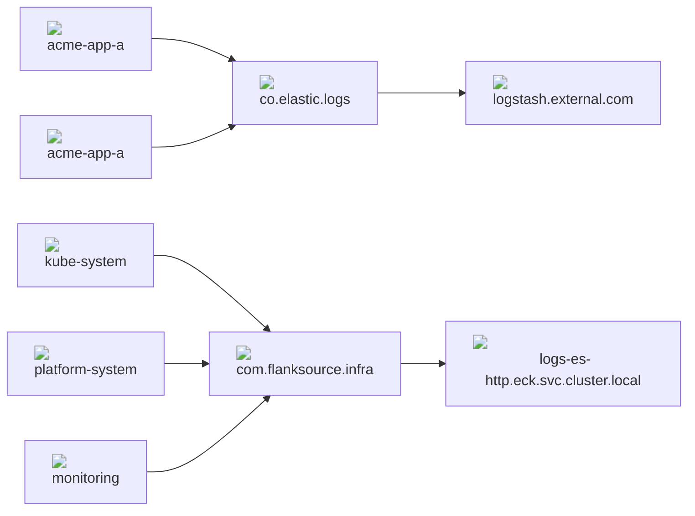

???+ asterix "Prerequisites"
     An [in-cluster](/operators/elastic) or externally deployed elasticsearch cluster.


`karina.yaml`
```yaml
filebeat:
  - name: infra
    version: 7.10.2
    index: filebeat-infra
    prefix: com.flanksource.infra
    elasticsearch:
      url: logs-es-http.eck.svc.cluster.local
      user: elastic
      password: elastic
      port: 9200
      scheme: https
```

```shell
karina deploy filebeat -c karina.yaml
```

## Pipelines

Karina can deploy multiple filebeat instances which is useful if you need to send logs to different elastic clusters or to introduce some fault-domain boundary in the logging pipeline.


<script src="https://unpkg.com/mermaid@8.6.4/dist/mermaid.min.js"></script>
<script>
mermaid.initialize({
  securityLevel: "loose",
  startOnLoad: true,
  logLevel: "info",
  });
  </script>


To setup the following logging pipeline:



:1: First create the filebeat instances (`com.flanksource.infra` and `co.elastic.logs`) these prefixes are used by <a href="https://www.elastic.co/guide/en/beats/filebeat/current/configuration-autodiscover-hints.html" target=_blank> :octicons-link-external-24: hint auto-discovery</a>


`karina.yaml`
```yaml
filebeat:
  - name: infra
    version: 7.10.2
    prefix: com.flanksource.infra
    elasticsearch:
      url: logs-es-http.eck.svc.cluster.local
      user: ...
      password: ...
  - name: apps
    version: 7.10.2
    prefix: co.elastic.logs
    logstash:
      url: logstash.external.corp
      user: ...
      password: ...
```
```shell
karina deploy filebeat -c karina.yaml
```
:2: Create the namespaces using the `co.elastic.logs` pipeline
```yaml
apiVersion: v1
kind: Namespace
metadata:
  name: acme-app-a
  annotations:
    co.elastic.logs/enabled: true
---
apiVersion: v1
kind: Namespace
metadata:
  name: acme-app-b
  annotations:
    co.elastic.logs/enabled: true
```

:3: Create the namespaces using the `com.flanksource.infra` pipeline
```yaml
apiVersion: v1
kind: Namespace
metadata:
  name: platform-system
  annotations:
    com.flanksource.infra/enabled: true
```

!!! note
    The namespaces managed by karina such as `platform-system` are configured by default to use the `com.flanksource.infra` pipeline.


:4: See [user-guide](/user-guide/logging) for details on how to filter and parse messages into structured logs.

## journalbeat

`karina.yaml`
```yaml
journalbeat:
  version: 7.10.2
  elasticsearch:
    url: logs-es-http.eck.svc.cluster.local
    user: elastic
    password: elastic
    port: 9200
    scheme: https
```
```shell
karina deploy journalbeat -c karina.yaml
```

## auditbeat

`karina.yaml`
```yaml
auditbeat:
  disabled: true
  version: 7.10.2
  elasticsearch:
    url: logs-es-http.eck.svc.cluster.local
    user: elastic
    password: elastic
    port: 9200
    scheme: http
```
```shell
karina deploy auditbeat -c karina.yaml
```

## packetbeat

`karina.yaml`
```yaml
packetbeat:
  version: 7.10.2
  elasticsearch:
    url: logs.127.0.0.1.nip.io
    user: elastic
    password: elastic
    port: 443
    scheme: https
  kibana:
    url: kibana.127.0.0.1.nip.io
    user: elastic
    password: elastic
    port: 443
    scheme: https
```
```shell
karina deploy packetbeat -c karina.yaml
```
