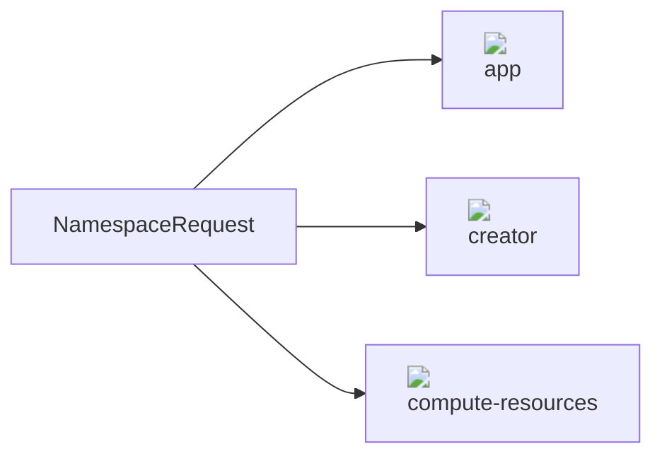

### Deploy
`karina.yml`

```yaml
templateOperator:
  version: v0.1.9
```

Deploy using:

```bash
karina deploy template-operator -c karina.yml
```


### Example

To setup a namespace request object that codifies the patterns for setting up a a Namespace with a ResourceQuota and RoleBinding:

<script src="https://unpkg.com/mermaid@8.6.4/dist/mermaid.min.js"></script>
<script>
mermaid.initialize({
  securityLevel: "loose",
  startOnLoad: true,
  logLevel: "info",
  });
  </script>





:1: Create the NamespaceRequest CRD

`namespace-request-crd.yml`

```yaml
apiVersion: apiextensions.k8s.io/v1beta1
kind: CustomResourceDefinition
metadata:
  name: namespacerequests.acmp.corp
spec:
  group: acmp.corp
  names:
    kind: NamespaceRequest
    listKind: NamespaceRequestList
    plural: namespacerequests
    singular: namespacerequest
  scope: Cluster
  version: v1
  versions:
    - name: v1
      served: true
      storage: true
```
```bash
kubectl apply -f namespace-request-crd.yml
```
:2: Create a Template that watches for new instances of NamespaceRequest

`namespace-request-template.yml`
```yaml
apiVersion: templating.flanksource.com/v1
kind: Template
metadata:
  name: namespace-request
spec:
  source:
    apiVersion: acmp.corp/v1
    kind: NamespaceRequest
  resources:
    - apiVersion: v1
      kind: Namespace
      metadata:
        name: "{{.metadata.name}}"
        annotations:
          team: "{{.spec.team}}"
          service: "{{.spec.service}}"
          company: "{{.spec.company}}"
          environment: "{{.spec.environment}}"

    - apiVersion: v1
      kind: ResourceQuota
      metadata:
        name: compute-resources
        namespace: "{{.metadata.name}}"
      spec:
        hard:
          requests.cpu: "1"
          requests.memory: 10Gi
          limits.cpu: "{{ math.Div .spec.memory 8 }}m"
          limits.memory: "{{.spec.memory}}Gi"
          pods: "{{ math.Mul .spec.memory 6 }}"
          services.loadbalancers: "0"
          services.nodeports: "0"

    - apiVersion: rbac.authorization.k8s.io/v1
      kind: RoleBinding
      metadata:
        name: creator
        namespace: "{{.metadata.name}}"
      subjects:
        - kind: Group
          name: "{{.spec.team}}"
          apiGroup: rbac.authorization.k8s.io
      roleRef:
        apiGroup: rbac.authorization.k8s.io
        kind: ClusterRole
        name: namespace-admin
```
```bash
kubectl apply -f namespace-request-template.yml
```

:3: Instantiate the template

`request.yml`

```yaml
apiVersion: acmp.corp/v1
kind: NamespaceRequest
metadata:
  name: app
spec:
  team: blue-team
  memory: 16
```

```bash
kubectl apply -f request.yml
```
